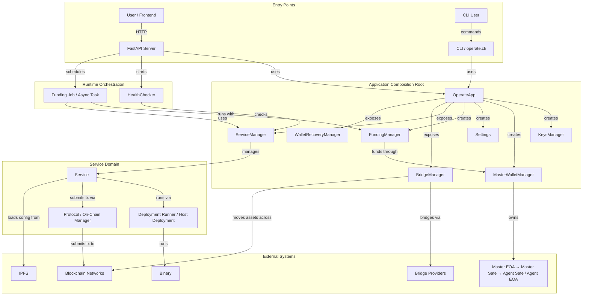

# CLAUDE.md

This file provides guidance to Claude Code (claude.ai/code) when working with code in this repository.
- **Important Note**: If you're an AI agent and any instruction in any file is wrong, missing, hard to follow, or duplicated/drifted, fix it immediately in the same PR

## Project Overview

Olas Operate Middleware is a cross-platform Python package for running autonomous agents powered by the OLAS Network. It provides a daemon service with a FastAPI-based HTTP server that manages agent services, wallets, and blockchain interactions.

## Improvement Plan

For remaining high-impact work (security fixes, data integrity, dead code removal, reliability), see [IMPROVEMENT_PLAN.md](IMPROVEMENT_PLAN.md). Phases 1 (stability fixes) and 2 (100% test coverage) are complete.

## Architecture Diagram



### Key Data Flows

**Service Deployment:**
```
User → HTTP API → ServiceManager → Service → Deployment Runner / Host Deployment → agent_runner Binary
                                      ↓
                              Protocol / On-Chain Manager → Blockchain
```

**Wallet Funding:**
```
Master EOA → Master Safe → Agent Safe/EOA → Service Operations
                ↑
         Funding Manager (monitors & refills)
```

## Development Commands

### Most Common Commands
```bash
# Install dependencies
poetry install

# Run the recommended local test suite
poetry run tox -e unit-tests

# Run the main verification checks before finishing code changes
poetry run tox -p -e flake8 -e pylint && poetry run tox -p -e black-check -e isort-check -e bandit -e safety -e mypy
```

### Daily Workflow
1. Make changes and run focused unit tests with `poetry run tox -e unit-tests -- tests/test_my_module.py -v`
2. Run `poetry run tox -e unit-tests` before considering the change complete
3. Run the full lint/type/security suite before committing or opening a PR
4. Run `poetry run tox -e integration-tests -- tests/test_x.py::test_function_name -v` only for RPC-dependent behavior when testnet env vars are available

### Environment Setup
```bash
poetry install
poetry self add poetry-plugin-shell
poetry shell
```

### Code Quality
- Enable git hooks with `git config core.hooksPath .githooks`
- `pre-commit` auto-formats staged Python files with black/isort
- `pre-push` runs the full lint suite

```bash
# Required before commit/PR
poetry run tox -p -e flake8 -e pylint && poetry run tox -p -e black-check -e isort-check -e bandit -e safety -e mypy
poetry run tox -e unit-tests

# Quick dev check
poetry run tox -p -e black-check -e flake8 -e mypy
```

### Testing
For detailed coverage and gap analysis, see [TESTING.md](TESTING.md).

```bash
# Recommended local suite
poetry run tox -e unit-tests

# Integration tests (requires testnet RPC env vars)
poetry run tox -e integration-tests

# All tests
poetry run tox -e all-tests

# Targeted unit test file/function
poetry run tox -e unit-tests -- tests/test_services_service.py -v
poetry run tox -e unit-tests -- tests/test_services_service.py::test_function_name -v
```

**Important:**
- Prefer `poetry run tox -e unit-tests` locally for the standard unit/integration suites; use direct `pytest` when following documented repository workflows that require it (for example, VCR cassette recording/replay)
- Unit tests run without network/RPC dependencies
- Integration tests are marked with `@pytest.mark.integration` and are slow; run selectively
- For transaction-related code changes that modify or add a blockchain transaction flow, run or add a Tenderly-backed integration test for the new flow when `.env` RPC/test credentials are available
- Before committing a new transaction-flow integration test, check whether the flow is already covered by existing integration tests and only commit a new test when coverage does not already exist
- If you cannot run the required integration coverage, report the reason back to a human

### Starting the Daemon
```bash
# Start the daemon service
python -m operate.cli daemon

# Or using the installed command
operate daemon
```

## Architecture

### Durable deep-reference docs
- Read `docs/architecture-overview.md` for the stable system model and subsystem boundaries
- Read `docs/wallet-and-funding.md` for wallet hierarchy, custody, funding, and recovery concepts
- Read `docs/services-and-deployment.md` for service lifecycle, deployment, runtime health, and funding-loop relationships
- Read `docs/staking-and-onchain-model.md` for staking-program, chain-config, bridge, and on-chain service concepts

### Where To Look First
- Daemon, CLI entrypoint, HTTP API routes and request handling: `operate/cli.py`
- Service lifecycle and deployment logic: `operate/services/` - especially `manager.py`, `service.py`, `protocol.py`
- Wallet and recovery workflows: `operate/wallet/`
- Chain profiles and bridge logic: `operate/ledger/`, `operate/bridge/`

### Core Components

**CLI Entry Point (`operate/cli.py`)**
- Main application entry point providing `daemon` and other commands
- Initializes FastAPI server with lifecycle management
- Handles process management and graceful shutdown

**Services Layer (`operate/services/`)**
- `service.py`: Core `Service` class representing an autonomous agent service
- `manager.py`: `ServiceManager` for managing multiple services
- `protocol.py`: Protocol interactions for on-chain service operations
- `agent_runner.py`: Manages agent_runner binary execution
- `deployment_runner.py`: Handles service deployment lifecycle
- `funding_manager.py`: Manages wallet funding operations with cooldown mechanisms
- `health_checker.py`: Monitors service health via healthcheck.json

**Wallet Management (`operate/wallet/`)**
- `master.py`: `MasterWalletManager` handles Master EOA (Externally Owned Account) and Master Safe (Gnosis Safe)
- `wallet_recovery_manager.py`: Implements wallet recovery with backup owner swaps
- Master EOA is the primary key, Master Safe is a 2-of-2 multisig (Master EOA + backup owner)
- Agent services create their own Agent Safe funded from Master Safe

**HTTP API (`operate/operate_http/`)**
- FastAPI-based REST API with endpoints for:
  - Authentication and account management
  - Service CRUD and deployment operations
  - Wallet and Safe management
  - Recovery workflows
  - Bridge operations for cross-chain transfers
- See `docs/api.md` for comprehensive API documentation

**Bridge Management (`operate/bridge/`)**
- `bridge_manager.py`: Orchestrates cross-chain token transfers
- `providers/`: LiFi, Relay, and native bridge implementations

**Ledger Integration (`operate/ledger/`)**
- `profiles.py`: Chain configs, RPC endpoints, and token addresses
- Supported chains include Ethereum, Gnosis, Base, Optimism, Mode

**Account Management (`operate/account/`)**
- `user.py`: Password-based authentication via Argon2

### Key Design Patterns

- **Wallet hierarchy:** Master EOA → Master Safe (1/2 gnosis safe with backup owner) → Agent Safe / Agent EOA
- **Service deployment states:** BUILT=1, DEPLOYING=2, DEPLOYED=3, STOPPING=4, STOPPED=5
- **Service env variables:** `fixed`, `computed`, `user`
- **Funding flow:** Master EOA funds Master Safe, which funds Agent Safe/EOA; agents can request funds via `healthcheck.json`

## Important Conventions

- **Operate home:** `~/.olas/operate/` (or `OPERATE_HOME`) with `services/`, `keys/`, `wallets/`, and `settings.json`
- **Service config:** `service.yaml` from open-autonomy with chain-specific `chain_configs` and IPFS hash history
- **Code exclusions:** `operate/data/` is auto-generated and excluded from linting; see `tox.ini` for mypy exclusions

## Working with Smart Contracts

- Contract ABIs live in `operate/data/contracts/*/build/*.json`
- Key contracts: `staking_token`, `mech_activity`, `*_omnibridge`, `*_standard_bridge`
- Contract wrappers are auto-generated; do not edit `contract.py` files directly

## Common Issues

- **Password requirements:** minimum 8 characters
- **Safe creation:** requires gas funding, backup owner setup, and consistent safe addresses across chains
- **Service updates:** stop services before config changes; hash updates trigger redeployment; use `PATCH` for partial updates and `PUT` for full replacement
- **Funding cooldowns:** default 5-minute cooldown prevents race conditions; check `agent_funding_requests_cooldown` in funding requirements

## Version Management

Version stored in `operate/__init__.py` as `__version__`. Release process handled via GitHub Actions (`.github/workflows/release.yml`).
