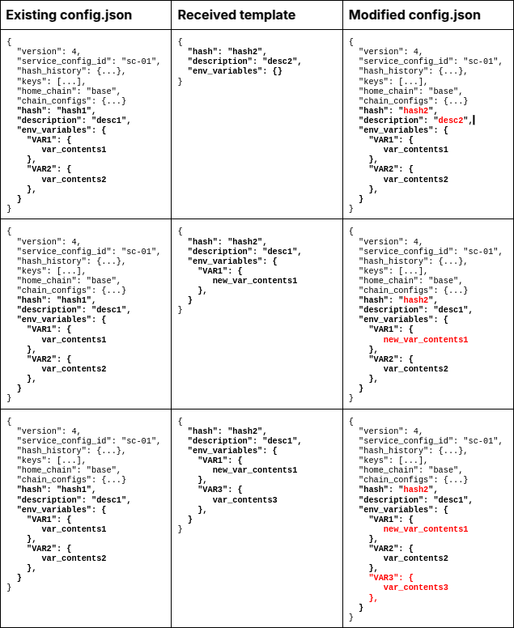

# Olas-Operate API reference

## General

### `GET /api`

Returns information of the operate daemon.

<details>
  <summary>Response</summary>

```json
{
  "name": "Operate HTTP server",
  "version": "0.1.0.rc0",
  "account": {
    "key": "0xf39Fd6e51aad88F6F4ce6aB8827279cffFb9226a"
  },
  "home": "/Users/virajpatel/valory/olas-operate-middleware/.operate"
}
```

</details>

---

## Account

### `GET /api/account`

Returns account status.

<details>
  <summary>Response</summary>

- Before setup:

    ```json
    {
      "is_setup": false
    }
    ```

- After setup:

  ```json
  {
    "is_setup": true
  }
  ```

</details>

---

### `POST /api/account`

Create a local user account.

<details>
  <summary>Request</summary>

```json
{
  "password": "Hello,World!",
}
```

</details>

<details>
  <summary>Response</summary>

- If account did not exist:

  ```json
  {
    "error": null
  }
  ```

- If account already exists:

  ```json
  {
    "error": "Account already exists"
  }
  ```

</details>

---

### `PUT /api/account`

Update account password by providing either current password or BIP-39 seed phrase.

<details>
  <summary>Request</summary>

```json
{
  "old_password": "1234567890",
  "new_password": "0987654321",
}
```

or

```json
{
  "mnemonic": "cousin weather coil range obey hungry",
  "new_password": "0987654321",
}
```

</details>

<details>
  <summary>Response</summary>

- If old password is not valid:

  ```json
  {
    "error": "Password is not valid.",
  }
  ```

- If old password is valid:

  ```json
  {
    "error": null,
    "message": "Password updated."
  }
  ```

- If seed phrase is not valid:

  ```json
  {
    "error": "Seed phrase is not valid.",
  }
  ```

- If seed phrase is valid:

```json
{
  "error": null,
  "message": "Password updated using seed phrase."
}
```

</details>

---

### `POST /api/account/login`

Login and create a session.

<details>
  <summary>Request</summary>

```json
{
  "password": "Hello,World",
}
```

</details>

<details>
  <summary>Response</summary>

- If password is valid:

  ```json
  {
    "message": "Login successful"
  }
  ```

- If password is not valid:

  ```json
  {
    "error": "Password is not valid"
  }
  ```

</details>

---

## Wallet

### `GET /api/wallet`

Returns a list of available wallets

<details>
  <summary>Response</summary>

```json
[
  {
    "address": "0xFafd5cb31a611C5e5aa65ea8c6226EB4328175E7",
    "safe_chains": [
      "gnosis"
    ],
    "ledger_type": 0,
    "safes": {
      "gnosis": "0xd56fb274ce2C66008D5c4C09980c4f36Ab81ff23"
    },
    "safe_nonce": 110558881674480320952254000342160989674913430251257716940579305238321962891821
  }
]
```

</details>

---

### `GET /api/extended/wallet`

Returns a list of available wallets with enriched information. It executes on-chain requests to populate the list of owners of each safe, and provides the attributes

- `consistent_backup_owner`: This flag is `true` when all safes across the chains have exactly the same set of backup owner addresses. It ensures that ownership is identical across all safes, regardless of the number of owners.
- `consistent_backup_owner_count`: This flag is `true` when all safes have exactly one backup owner.
- `consistent_safe_address`: This flag is `true` when all chains have the same safe address. It ensures there is a single safe address consistently used across all chains.

<details>
  <summary>Response</summary>

```json
[
  {
    "address":"0xFafd5cb31a611C5e5aa65ea8c6226EB4328175E7",
    "consistent_backup_owner": false,
    "consistent_backup_owner_count": false,
    "consistent_safe_address": true,
    "ledger_type":"ethereum",
    "safe_chains":[
      "gnosis",
      "ethereum",
      "base",
      "optimistic"
    ],
    "safe_nonce":110558881674480320952254000342160989674913430251257716940579305238321962891821,
    "safes":{
      "base":{
        "0xd56fb274ce2C66008D5c4C09980c4f36Ab81ff23":{
          "backup_owners": [],  // Empty = no backup owners
          "balances": {...}
        }
      },
      "ethereum":{
        "0xd56fb274ce2C66008D5c4C09980c4f36Ab81ff23":{
          "backup_owners":[
            "0x46eC2E77Fe3E367252f1A8a77470CE8eEd2A985b"
          ],
          "balances": {...}
        }
      },
      "gnosis":{
        "0xd56fb274ce2C66008D5c4C09980c4f36Ab81ff23":{
          "backup_owners":[
            "0x46eC2E77Fe3E367252f1A8a77470CE8eEd2A985b"
          ],
          "balances": {
            "0x0000000000000000000000000000000000000000": 995899999999999999998, // xDAI
            "0xDDAfbb505ad214D7b80b1f830fcCc89B60fb7A83": 0,                     // USDC
            "0xcE11e14225575945b8E6Dc0D4F2dD4C570f79d9f": 960000000000000000000  // OLAS
        }
      },
      "optimistic":{
        "0xd56fb274ce2C66008D5c4C09980c4f36Ab81ff23":{
          "backup_owners":[
            "0x46eC2E77Fe3E367252f1A8a77470CE8eEd2A985b"
          ],
          "balances": {...}
        }
      }
    },
    "single_backup_owner_per_safe":false
  }
]
```

</details>

---

### `POST /api/wallet`

Creates a master wallet for a given ledger type. If a wallet already exists for a given ledger type, it returns the already existing wallet without creating an additional one.

<details>
  <summary>Request</summary>

```json
{
  "ledger_type": LedgerType,
}
```

</details>

<details>
  <summary>Response</summary>

```json
{
  "wallet": {
    "address": "0xAafd5cb31a611C5e5aa65ea8c6226EB4328175E1",
    "safe_chains": [],
    "ledger_type": 0,
    "safes": {},
    "safe_nonce": null
  },
  "mnemonic": ["polar", "mail", "tattoo", "write", "track", ... ]
}
```

</details>

---

### `POST /api/wallet/safe`

Creates a Gnosis safe for given chain.

<details>
  <summary>Request</summary>

```json
{
  "chain": "gnosis",
  "backup_owner": "0x46eC2E77Fe3E367252f1A8a77470CE8eEd2A985b",
  "initial_funds": {
    "0x0000000000000000000000000000000000000000": 1000000000000000000,
    "0xcE11e14225575945b8E6Dc0D4F2dD4C570f79d9f": 0
  }
}
```

</details>

<details>
  <summary>Response</summary>

- If Gnosis safe creation is successful:

  ```json
  {
    "safe": "0x29e23F7705d849F368855947691cB133CD770752",
    "message": "Safe created!"
  }
  ```

- If Gnosis safe creation is not successful:

  ```json
  {
    "error": "Error message",
    "traceback": "Traceback message"
  }
  ```

</details>

---

### `PUT /api/wallet/safe`

Upadtes a Gnosis safe for given chain. If no `backup_owner` is provided, it will assume a null value, that is, it will remove the backup owner from the safe.

<details>
  <summary>Request</summary>

```js
{
  "chain": Chain,
  "backup_owner": "0x650e83Bc808B8f405A9aF7CF68644cc817e084A6"  // Optional.
}
```

</details>

<details>
  <summary>Response</summary>

- If Gnosis safe update is successful:

  ```json
  {
    "backup_owner_updated": true,
    "chain": "gnosis",
    "message": "Backup owner updated.",
    "wallet": {
      "address": "0xFafd5cb31a611C5e5aa65ea8c6226EB4328175E7",
      "safe_chains": [
        "gnosis"
      ],
      "ledger_type": 0,
      "safes": {
        "gnosis": "0xd56fb274ce2C66008D5c4C09980c4f36Ab81ff23"
      },
      "safe_nonce": 110558881674480320952254000342160989674913430251257716940579305238321962891821
    }
  }
  ```

- If Gnosis safe update is successful, but no changes required in the safe:

  ```json
  {
    "backup_owner_updated": false,
    "chain": "gnosis",
    "message": "No changes on backup owner. The backup owner provided matches the current one.",
    "wallet": {
      "address": "0xFafd5cb31a611C5e5aa65ea8c6226EB4328175E7",
      "safe_chains": [
        "gnosis"
      ],
      "ledger_type": 0,
      "safes": {
        "gnosis": "0xd56fb274ce2C66008D5c4C09980c4f36Ab81ff23"
      },
      "safe_nonce": 110558881674480320952254000342160989674913430251257716940579305238321962891821
    }
  }
  ```

- If Gnosis safe creation is not successful:

  ```json
  {
    "error": "Error message",
    "traceback": "Traceback message"
  }
  ```

</details>

---

## Services

### `GET /api/v2/services`

Returns the list of existing service configurations.

<details>
  <summary>Response</summary>

```json
[
  {
    "chain_configs": {...},
    "description": "Trader agent for omen prediction markets",
    "env_variables": {...},
    "hash": "bafybeidicxsruh3r4a2xarawzan6ocwyvpn3ofv42po5kxf7x6ck7kn22u",
    "hash_history": {"1731487112": "bafybeidicxsruh3r4a2xarawzan6ocwyvpn3ofv42po5kxf7x6ck7kn22u"},
    "home_chain": "gnosis",
    "keys": [...],
    "name": "valory/trader_omen_gnosis",
    "service_config_id": "sc-85a7a12a-8c6b-46b8-919a-b8a3b8e3ad39",
    "package_path": "trader_pearl",
    "version": 4
  },
  ...
]
```

</details>

---

#### `POST /api/v2/services`

Create a service configuration using a template.

<details>
  <summary>Request</summary>

```json
  {
    "configurations": {...},
    "description": "Trader agent for omen prediction markets",
    "env_variables": {...},
    "hash": "bafybeidicxsruh3r4a2xarawzan6ocwyvpn3ofv42po5kxf7x6ck7kn22u",
    "image": "https://operate.olas.network/_next/image?url=%2Fimages%2Fprediction-agent.png&w=3840&q=75",
    "home_chain": "gnosis",
    "name": "valory/trader_omen_gnosis",
    "service_version": "v0.18.4"
  }
```

</details>

<details>
  <summary>Response</summary>

```json
{
  "chain_configs": {...},
  "description": "Trader agent for omen prediction markets",
  "env_variables": {...},
  "hash": "bafybeidicxsruh3r4a2xarawzan6ocwyvpn3ofv42po5kxf7x6ck7kn22u",
  "hash_history": {"1731487112": "bafybeidicxsruh3r4a2xarawzan6ocwyvpn3ofv42po5kxf7x6ck7kn22u"},
  "home_chain": "gnosis",
  "keys": [...],
  "name": "valory/trader_omen_gnosis",
  "service_config_id": "sc-85a7a12a-8c6b-46b8-919a-b8a3b8e3ad39",
  "package_path": "trader_pearl",
  "version": 4
}
```

</details>

---

### `PUT /api/v2/services`

Update all the service configurations whose Service Public ID match the Service Public ID in the provided hash.

<details>
  <summary>Request</summary>

```json
  {
    "configurations": {...},
    "description": "Trader agent for omen prediction markets",
    "env_variables": {...},
    "hash": "bafybeibpseosblmaw6sk6zsnic2kfxfsijrnfluuhkwboyqhx7ma7zw2me",
    "image": "https://operate.olas.network/_next/image?url=%2Fimages%2Fprediction-agent.png&w=3840&q=75",
    "home_chain": "gnosis",
    "name": "valory/trader_omen_gnosis",
    "service_version": "v0.19.0"
  }
```

</details>

<details>
  <summary>Response</summary>

The response contains an array of the services which have been updated (an empty array if no service matches the Service Public ID in the provided hash).

```json
[
  {
    "chain_configs": {...},
    "description": "Trader agent for omen prediction markets",
    "env_variables": {...},
    "hash": "bafybeidicxsruh3r4a2xarawzan6ocwyvpn3ofv42po5kxf7x6ck7kn22u",
    "hash_history": {"1731487112": "bafybeidicxsruh3r4a2xarawzan6ocwyvpn3ofv42po5kxf7x6ck7kn22u", "1731490000": "bafybeibpseosblmaw6sk6zsnic2kfxfsijrnfluuhkwboyqhx7ma7zw2me"},
    "home_chain": "gnosis",
    "keys": [...],
    "name": "valory/trader_omen_gnosis",
    "service_config_id": "sc-85a7a12a-8c6b-46b8-919a-b8a3b8e3ad39",
    "package_path": "trader_pearl",
    "version": 4
  },
  ...
]
```

</details>

---

#### `POST /api/v2/services/stop` (alias `GET /stop_all_services`)

Stop all running deployments.

<details>
  <summary>Response</summary>

- If the operation was successful:
  
  ```json
  {
    "message": "Services stopped."
  }
  ```

- If the operation was not successful:

  ```json
  {
    "error": "Error message",
    "traceback": "Traceback message"
  }
  ```

</details>

---

## Service

### `GET /api/v2/service/{service_config_id}`

Returns the service configuration `service_config_id`.

<details>
  <summary>Response</summary>

- If service configuration `service_config_id` exists:

  ```json
  {
    "chain_configs": {...},
    "description": "Trader agent for omen prediction markets",
    "env_variables": {...},
    "hash": "bafybeidicxsruh3r4a2xarawzan6ocwyvpn3ofv42po5kxf7x6ck7kn22u",
    "hash_history": {"1731487112": "bafybeidicxsruh3r4a2xarawzan6ocwyvpn3ofv42po5kxf7x6ck7kn22u"},
    "home_chain": "gnosis",
    "keys": [...],
    "name": "valory/trader_omen_gnosis",
    "service_config_id": "sc-85a7a12a-8c6b-46b8-919a-b8a3b8e3ad39",
    "package_path": "trader_pearl",
    "version": 4
  }

  ```

- If service configuration `service_config_id` does not exist:
  
  ```json
  {
    "error": "Service foo not found"
  }
  ```

</details>

---

### `POST /api/v2/service/{service_config_id}`

Deploy service with service configuration `service_config_id` on-chain and run local deployment. This endpoint executes the following tasks:

1. Stops any running service.
2. Ensures that the service is deployed on-chain on all the configured chains.
3. Ensures that the the service is staked on all the configured chains.
4. Runs the service locally.
5. Starts funding job.
6. Starts healthcheck job.

</details>

<details>
  <summary>Response</summary>

The response contains the updated service configuration following the on-chain operations, including service Gnosis safe, on-chain token, etc.

```json
{
  "chain_configs": {...},
  "description": "Trader agent for omen prediction markets",
  "env_variables": {...},
  "hash": "bafybeidicxsruh3r4a2xarawzan6ocwyvpn3ofv42po5kxf7x6ck7kn22u",
  "hash_history": {"1731487112": "bafybeidicxsruh3r4a2xarawzan6ocwyvpn3ofv42po5kxf7x6ck7kn22u"},
  "home_chain": "gnosis",
  "keys": [...],
  "name": "valory/trader_omen_gnosis",
  "service_config_id": "sc-85a7a12a-8c6b-46b8-919a-b8a3b8e3ad39",
  "package_path": "trader_pearl"
}

```

</details>

---

### `PUT /api/v2/service/{service_config_id}`

Update service configuration `service_config_id` with the provided template.

<details>
  <summary>Request</summary>

```json
  {
    "configurations": {...},
    "description": "Trader agent for omen prediction markets",
    "env_variables": {...},
    "hash": "bafybeibpseosblmaw6sk6zsnic2kfxfsijrnfluuhkwboyqhx7ma7zw2me",
    "image": "https://operate.olas.network/_next/image?url=%2Fimages%2Fprediction-agent.png&w=3840&q=75",
    "home_chain": "gnosis",
    "name": "valory/trader_omen_gnosis",
    "service_version": "v0.19.0"
  }
```

</details>

<details>
  <summary>Response</summary>

- If the update is successful, the response contains the updated service configuration:

  ```json
  {
    "chain_configs": {...},
    "description": "Trader agent for omen prediction markets",
    "env_variables": {...},
    "hash": "bafybeidicxsruh3r4a2xarawzan6ocwyvpn3ofv42po5kxf7x6ck7kn22u",
    "hash_history": {"1731487112": "bafybeidicxsruh3r4a2xarawzan6ocwyvpn3ofv42po5kxf7x6ck7kn22u", "1731490000": "bafybeibpseosblmaw6sk6zsnic2kfxfsijrnfluuhkwboyqhx7ma7zw2me"},
    "home_chain": "gnosis",
    "keys": [...],
    "name": "valory/trader_omen_gnosis",
    "service_config_id": "sc-85a7a12a-8c6b-46b8-919a-b8a3b8e3ad39",
    "package_path": "trader_pearl"
  }

  ```

- If the update is not successful:

  ```json
  {
    "error": "Error message",
    "traceback": "Traceback message"
  }
  ```

</details>

---

### `PATCH /api/v2/service/{service_config_id}`

Partial update service configuration `service_config_id` with the provided (partial) template.



<details>
  <summary>Request</summary>

```json
  {
    "configurations": {...},
    "description": "Trader agent for omen prediction markets",
    "env_variables": {...},
    "hash": "bafybeibpseosblmaw6sk6zsnic2kfxfsijrnfluuhkwboyqhx7ma7zw2me",
    "image": "https://operate.olas.network/_next/image?url=%2Fimages%2Fprediction-agent.png&w=3840&q=75",
    "home_chain": "gnosis",
    "name": "valory/trader_omen_gnosis",
    "service_version": "v0.19.0"
  }
```

</details>

<details>
  <summary>Response</summary>

- If the update is successful, the response contains the updated service configuration:

  ```json
  {
    "chain_configs": {...},
    "description": "Trader agent for omen prediction markets",
    "env_variables": {...},
    "hash": "bafybeidicxsruh3r4a2xarawzan6ocwyvpn3ofv42po5kxf7x6ck7kn22u",
    "hash_history": {"1731487112": "bafybeidicxsruh3r4a2xarawzan6ocwyvpn3ofv42po5kxf7x6ck7kn22u", "1731490000": "bafybeibpseosblmaw6sk6zsnic2kfxfsijrnfluuhkwboyqhx7ma7zw2me"},
    "home_chain": "gnosis",
    "keys": [...],
    "name": "valory/trader_omen_gnosis",
    "service_config_id": "sc-85a7a12a-8c6b-46b8-919a-b8a3b8e3ad39",
    "package_path": "trader_pearl"
  }

  ```

- If the update is not successful:

  ```json
  {
    "error": "Error message",
    "traceback": "Traceback message"
  }
  ```

</details>

---

### `POST /api/v2/service/{service_config_id}/deployment/stop`

Stop service with service configuration `service_configuration_id`.

<details>
  <summary>Response</summary>

```json
  {
    "nodes": {
      "agent": [],
      "tendermint": []
    },
    "status": 1
  }
```

</details>

---

### `GET /api/v2/service/{service_config_id}/refill_requirements`

Returns the service refill requirements for `service_config_id`, in terms of refill requirements for the master safe and master signer. The output data structure returns the user refill requirements per chain, address and token.

The refill requirements are computed based on the fund requirements present on the service template and the current balances of the agents, service safe, master signer and master safe.

<details>
  <summary>Response</summary>

- If service configuration `service_config_id` exists:

  ```json
  {
    "allow_start_agent": true,
    "balances": {
      "gnosis": {
        "0x364fD50CB11B2fbc39706D4649f29508A7685538": {
          "0x0000000000000000000000000000000000000000": 5420000000000000000,
          "0xcE11e14225575945b8E6Dc0D4F2dD4C570f79d9f": 0
        },
        "0xDe6B572A049B27D349e89aD0cBEF102227e31473": {
          "0x0000000000000000000000000000000000000000": 977830935992610300,
          "0xcE11e14225575945b8E6Dc0D4F2dD4C570f79d9f": 0
        },
        "0x28580196F52DB3C95C3d40Df88426e251d115842": {
          "0x0000000000000000000000000000000000000000": 995900000000000000000,
          "0xcE11e14225575945b8E6Dc0D4F2dD4C570f79d9f": 60000000000000000000
        },
        "0x28dD3709cF084D889f38d11dBC2435B31543294B": {
          "0x0000000000000000000000000000000000000000": 100000000000000000,
          "0xcE11e14225575945b8E6Dc0D4F2dD4C570f79d9f": 0
        }
      }
    },
    "bonded_assets": {
      "gnosis": {
        "0x0000000000000000000000000000000000000000": 2,
        "0xcE11e14225575945b8E6Dc0D4F2dD4C570f79d9f": 40000000000000000000
      }
    },
    "is_refill_required": false,
    "refill_requirements": {
      "gnosis": {
        "0x28580196F52DB3C95C3d40Df88426e251d115842": {
          "0x0000000000000000000000000000000000000000": 0,
          "0xcE11e14225575945b8E6Dc0D4F2dD4C570f79d9f": 0
        },
        "0xDe6B572A049B27D349e89aD0cBEF102227e31473": {
         "0x0000000000000000000000000000000000000000": 0,
         "0xcE11e14225575945b8E6Dc0D4F2dD4C570f79d9f": 0
        }
      }
    },
    "service_asset_requirements": {
      "gnosis": {
        "0x0000000000000000000000000000000000000000": 2,
        "0xcE11e14225575945b8E6Dc0D4F2dD4C570f79d9f": 40000000000000000000
      }
    },
  }
  ```

- If service configuration `service_config_id` does not exist:
  
  ```json
  {
    "error": "Service foo not found"
  }
  ```

</details>

---

## Bridge

### `POST /api/bridge/bridge_refill_requirements`

Creates a quote bundle to fulfill the bridge requests and returns

- the refill requirements on the source chain for bridging assets to target chains,
- the quote bundle id to execute the request.

<details>
  <summary>Request</summary>

```json
  {
    "bridge_requests": [
      {
        "from": {
          "chain": "ethereum",
          "address": "0xDe6B572A049B27D349e89aD0cBEF102227e31473",
          "token": "0x0000000000000000000000000000000000000000"
        },
        "to": {
          "chain": "gnosis",
          "address": "0xDe6B572A049B27D349e89aD0cBEF102227e31473",
          "token": "0x0000000000000000000000000000000000000000",
          "amount": 10000000000000000000
        },
      },
      {
        "from": {
          "chain": "ethereum",
          "address": "0xDe6B572A049B27D349e89aD0cBEF102227e31473",
          "token": "0x0000000000000000000000000000000000000000"
        },
        "to": {
          "chain": "gnosis",
          "address": "0x28580196F52DB3C95C3d40Df88426e251d115842",
          "token": "0x0000000000000000000000000000000000000000",
          "amount": 10000000000000000000
        }
      }
    ],
    "force_update": false
  }
```

</details>

<details>
  <summary>Response</summary>

  ```json
  {
    "id": "qb-bdaafd7f-0698-4e10-83dd-d742cc0e656d",
    "balances": {
      "ethereum": {
        "0xDe6B572A049B27D349e89aD0cBEF102227e31473": {
          "0x0000000000000000000000000000000000000000": 0,
          "0x0001A500A6B18995B03f44bb040A5fFc28E45CB0": 0
        }
      }
    },
    "bridge_total_requirements": {
      "ethereum": {
        "0x0000000000000000000000000000000000000000": 10073082159280405,
        "0x0001A500A6B18995B03f44bb040A5fFc28E45CB0": 61944358967139717502
      }
    },
    "bridge_refill_requirements": {
      "ethereum": {
        "0xDe6B572A049B27D349e89aD0cBEF102227e31473": {
          "0x0000000000000000000000000000000000000000": 10073082159280405,
          "0x0001A500A6B18995B03f44bb040A5fFc28E45CB0": 61944358967139717502
        }
      }
    },
    "expiration_timestamp": 1743000251,
    "is_refill_required": true,
    "bridge_request_status": [
      {
        "message": "",
        "status": "QUOTE_DONE",
      },
      {
        "message": "",
        "status": "QUOTE_DONE",
      }
    ],
    "error": false
  }
  ```

</details>

---

### `POST /api/bridge/execute`

Executes a quote bundle. See [GET /api/bridge/status/{quote_bundle_id}](#get-apibridgestatusquote_bundle_id) for status values.

<details>
  <summary>Request</summary>

```json
  {
    "id": "qb-bdaafd7f-0698-4e10-83dd-d742cc0e656d"
  }
```

</details>

<details>
  <summary>Response</summary>

  ```json
  {
    "id": "qb-bdaafd7f-0698-4e10-83dd-d742cc0e656d",
    "status": "SUBMITTED",
    "bridge_request_status": [
      {
        "explorer_link": "https://scan.li.fi/tx/0x3795206347eae1537d852bea05e36c3e76b08cefdfa2d772e24bac2e24f31db3",
        "message": null,
        "status": "EXECUTION_DONE",
        "tx_hash": "0x3795206347eae1537d852bea05e36c3e76b08cefdfa2d772e24bac2e24f31db3",
      },
      {
        "explorer_link": "https://scan.li.fi/tx/0x0e53f1b6aa5552f2d4cfe8e623dd95e54ca079c4b23b89d0c0aa6ed4a6442384",
        "message": null,
        "status": "EXECUTION_PENDING",
        "tx_hash": "0x0e53f1b6aa5552f2d4cfe8e623dd95e54ca079c4b23b89d0c0aa6ed4a6442384",
      }
    ],
    "error": false
  }
  ```

</details>

---

### `GET /api/bridge/status/{quote_bundle_id}`

Gets the status of a quote bundle. The attribute `status` can take the following values sequentially:

- `CREATED`: The quote bundle internal data structure has been created, but no quotes have been requested yet.
- `QUOTE_DONE`: A quote is available for all bridge requests. Quote updates are possible in this state if either expired or forced through the [POST /api/bridge/bridge_refill_requirements](#post-apibridgebridge_refill_requirements) endpoint by setting `force_update=true`.
- `QUOTE_FAILED`: Quote failed for some bridge requests. Quote updates are possible in this state if either expired or forced through the [POST /api/bridge/bridge_refill_requirements](#post-apibridgebridge_refill_requirements) endpoint by setting `force_update=true`.
- `EXECUTION_PENDING`: Execution submitted and pending to be finalized for some bridge request.
- `EXECUTION_DONE`: Execution finalized successfully for all requests.
- `EXECUTION_FAILED`: Execution failed.

Individual bridge request status:

- `QUOTE_DONE`: A quote is available.
- `QUOTE_FAILED`: Failed to request a quote.
- `EXECUTION_PENDING`: Execution submitted and pending to be finalized.
- `EXECUTION_DONE`: Execution finalized successfully.
- `EXECUTION_FAILED`: Execution failed.

<details>
  <summary>Response</summary>

  ```json
  {
    "id": "qb-bdaafd7f-0698-4e10-83dd-d742cc0e656d",
    "status": "SUBMITTED",
    "bridge_request_status": [
      {
        "explorer_link": "https://scan.li.fi/tx/0x3795206347eae1537d852bea05e36c3e76b08cefdfa2d772e24bac2e24f31db3",
        "message": null,
        "status": "EXECUTION_DONE",
        "tx_hash": "0x3795206347eae1537d852bea05e36c3e76b08cefdfa2d772e24bac2e24f31db3",
      },
      {
        "explorer_link": "https://scan.li.fi/tx/0x0e53f1b6aa5552f2d4cfe8e623dd95e54ca079c4b23b89d0c0aa6ed4a6442384",
        "message": null,
        "status": "EXECUTION_PENDING",
        "tx_hash": "0x0e53f1b6aa5552f2d4cfe8e623dd95e54ca079c4b23b89d0c0aa6ed4a6442384",
      }
    ],
    "error": false
  }
  ```

</details>

---

## Unused endpoints

### `POST /api/services/{service}/onchain/deploy`

**:warning: Deprecated**

Deploy service on-chain

<details>
  <summary>Request</summary>

```json
```

</details>

<details>
  <summary>Response</summary>

```json
```

</details>

---

### `POST /api/services/{service}/onchain/stop`

**:warning: Deprecated**

Stop service on-chain

<details>
  <summary>Request</summary>

```json
```

</details>

<details>
  <summary>Response</summary>

```json
```

</details>

---

### `GET /api/services/{service}/deployment`

**:warning: Deprecated**

<details>
  <summary>Response</summary>

```json
{
  "status": 1,
  "nodes": {
    "agent": [
      "traderomengnosis_abci_0"
    ],
    "tendermint": [
      "traderomengnosis_tm_0"
    ]
  }
}
```

</details>

---

### `POST /api/services/{service}/deployment/build`

**:warning: Deprecated**

Build service locally

<details>
  <summary>Request</summary>

```json
```

</details>

<details>
  <summary>Response</summary>

```json
```

</details>

---

### `POST /api/services/{service}/deployment/start`

**:warning: Deprecated**

Start agent

<details>
  <summary>Request</summary>

```json
```

</details>

<details>
  <summary>Response</summary>

```json
```

</details>

---

### `POST /api/services/{service}/deployment/stop`

**:warning: Deprecated**

Stop agent

```json
```

---

### `POST /api/services/{service}/deployment/delete`

**:warning: Deprecated**

Delete local deployment

<details>
  <summary>Request</summary>

```json
```

</details>

<details>
  <summary>Response</summary>

```json
```

---
#### `POST /api/services/{service}/onchain/withdraw`

Withdraw all the funds from the service safe, service signer(s), master safe, and master signer.

<details>
  <summary>Request</summary>

```json
{
  "withdrawal_address": "0x0000000000000000000000000000000000000000"
}
```

</details>

<details>
  <summary>Response 200</summary>

```json
{
  "error": null
}
```

</details>

<details>
  <summary>Response 500</summary>

```json
{
  "error": "Insufficient funds",
  "traceback": "<a long stringified traceback here>"
}
```

</details>

<!-- 

<details>
  <summary>Request</summary>

```json
```

</details>

<details>
  <summary>Response</summary>

```json
```
</details>

-->
